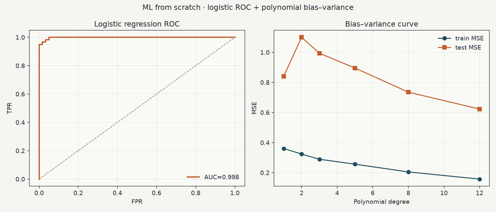
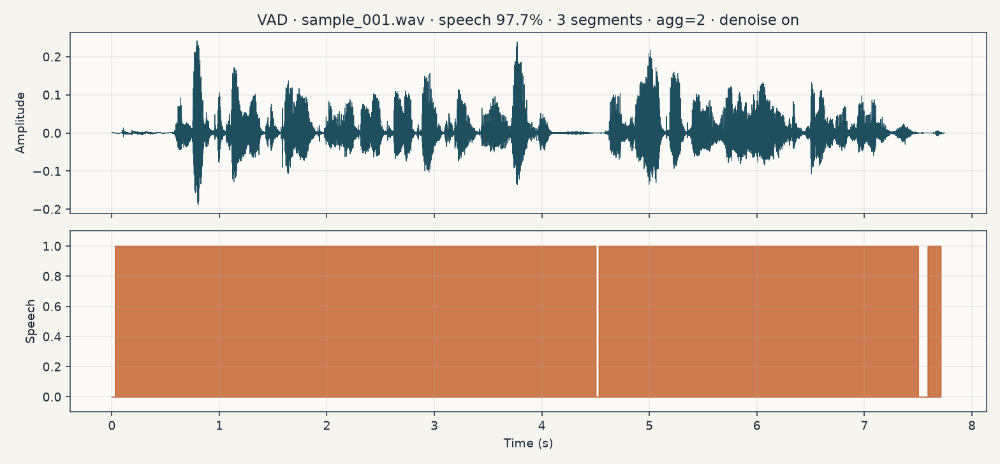
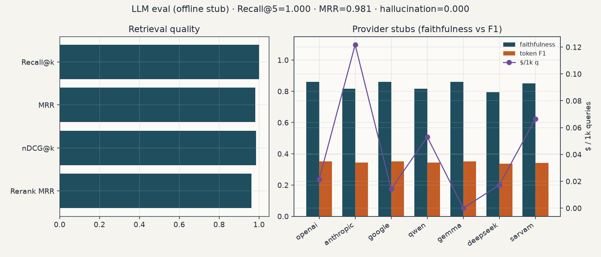
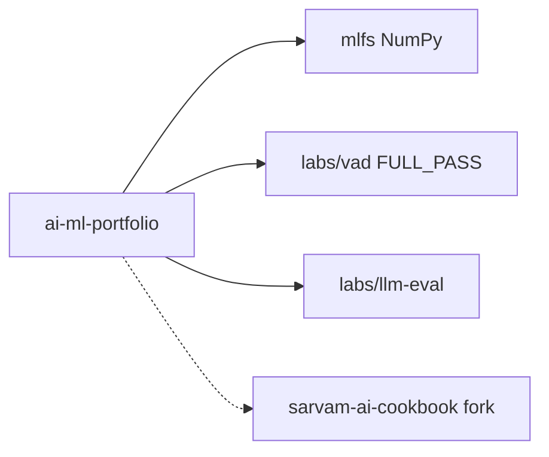

# AI/ML Portfolio

[](https://github.com/mangeshraut712/ai-ml-portfolio/actions/workflows/ci.yml)
[](https://www.python.org/downloads/)
[](https://numpy.org/)
[](https://streamlit.io/)
[](LICENSE)

**One clone → three hiring signals:** NumPy ML from scratch, speech VAD with labeled F1 gates, and offline LLM/RAG evaluation.

**Home:** this README (GitHub). **Interactive UIs (local):** `make run-vad-ui` · `make run-llm-eval-ui`. No hosted Streamlit/Vercel app — clone and run.

> **Proof (CI-verified)** — [CI](https://github.com/mangeshraut712/ai-ml-portfolio/actions/workflows/ci.yml) · Python **3.10–3.12** matrix green · `make verify-all` / `make verify-vad-pass` → **FULL_PASS**  
> VAD: exact clean F1 **0.9569** · noisy **0.7768** · soft **0.8135** · p95 ~**19 ms** · sample_001 **258/258**  
> LLM eval: [`DATA_CARD.md`](labs/llm-eval/DATA_CARD.md) · [`RESULTS.md`](labs/llm-eval/RESULTS.md) (stub baseline in CI; live optional)

| Lab | Prove in 60s | Signal |
|---|---|---|
| **MLFS** (`mlfs/`) | `make test-mlfs && make demo` | Derive GD, trees, ROC, MLP backprop, attention |
| **VAD** (`labs/vad/`) | `make verify-vad-pass` → **FULL_PASS** | Denoiser → WebRTC GMM → hangover; F1 ≈ 0.957 |
| **LLM eval** (`labs/llm-eval/`) | `make lab-llm-eval` | Recall@k / MRR / nDCG, faithfulness, cost matrix |

Sibling (kept separate on purpose): [`sarvam-ai-cookbook`](https://github.com/mangeshraut712/sarvam-ai-cookbook) — India-first Sarvam API demos + Next.js showcase (upstream fork).

---

## Gallery

Plots captured from the same lab paths as `make demo`, `make lab-llm-eval`, and the VAD Streamlit timeline (`make run-vad-ui`). Refresh with `python docs/screenshots/render_gallery.py`.

**ML from scratch** — logistic ROC + polynomial bias–variance (`mlfs/`)



**VAD** — denoiser + WebRTC GMM on `sample_001.wav` (aggressiveness 2)



**LLM eval** — offline stub retrieval + provider matrix (`labs/llm-eval/`)



---

## Quick start

```bash
git clone https://github.com/mangeshraut712/ai-ml-portfolio.git
cd ai-ml-portfolio
make install
make verify-all
```

`verify-all` runs MLFS tests, LLM-eval smoke, and the VAD **FULL_PASS** acceptance gate (always stub / offline).

Optional live LLM eval (not part of CI):

```bash
EVAL_LIVE=1 OPENAI_API_KEY=... make lab-llm-eval-live
```

---

## Layout

```text
.
├── mlfs/                 # Classical ML + mini-DL (NumPy)
├── tests/                # MLFS unit tests
├── labs/
│   ├── vad/              # Speech VAD challenge (FULL_PASS)
│   └── llm-eval/         # Offline RAG / LLM evaluation
├── sample_data/          # 50× 16 kHz WAVs + labeled ground truth
├── notebooks/            # Walkthroughs
├── docs/screenshots/     # README gallery (rendered from labs)
├── INTERVIEW_NOTES.md    # Pivot talking points
├── Makefile
└── .github/workflows/ci.yml
```



---

## Role fit

| Role | Fit | Why |
|---|---|---|
| Applied ML Engineer | **Strong** | Ship + measure (VAD gates, RAG metrics) |
| Speech / Audio ML | **Strong** | Proctored-style VAD, latency/RTF evidence |
| LLM / RAG Engineer | **Good → Strong** | Retrieval + faithfulness + cost (expand gold for research bar) |
| Classical ML pivot | **Strong** | From-scratch algorithms + interview notes |
| Research (DL-heavy) | **Emerging** | MLP + attention from scratch; add a public train/eval card next |

---

## Labs

### 1) Machine Learning From Scratch

```bash
make test-mlfs
make demo
```

Linear/logistic, trees/RF/GBDT, KNN, NB, SVM, PCA, KMeans, GD, CV, ROC/AUC, calibration, bias–variance, **MLP backprop**, **attention**. See [`INTERVIEW_NOTES.md`](./INTERVIEW_NOTES.md).

### 2) VAD Interview Challenge

Spectral-gate denoiser → WebRTC GMM (aggressiveness 2) → hangover. No external inference APIs.

| Metric | Measured |
|---|---:|
| Exact clean mean F1 | **0.9569** |
| Exact noisy mean F1 | **0.7768** |
| Soft mean F1 | **0.8135** |
| Steady p95 latency | **~19 ms** |
| sample_001 frames | **258/258** |

```bash
make verify-vad-pass
make run-vad-ui
```

Experimental neural / energy VAD A/B (`--backend neural|compare`) is available for local comparison; **WebRTC aggressiveness 2 remains the FULL_PASS gate** (`challenge_pass.py` unchanged).


### 3) LLM Evaluation Lab

Offline-first (stub generators without API keys): TF-IDF → BM25 fusion → faithfulness / hallucination → prompt A/B → latency & $/1k → multi-model matrix. Optional live path: `EVAL_LIVE=1` + provider keys (`make lab-llm-eval-live`). Gold: 40 QA + 15 adversarial — see [`DATA_CARD.md`](labs/llm-eval/DATA_CARD.md) and stub/live metrics in [`RESULTS.md`](labs/llm-eval/RESULTS.md).

```bash
make lab-llm-eval-test
make lab-llm-eval
make run-llm-eval-ui
```

---

## CI

GitHub Actions runs on Python **3.10 / 3.11 / 3.12**:

- MLFS pytest + demos  
- VAD unit tests + **FULL_PASS** gate  
- LLM-eval tests + smoke report  

---

## Related repos

| Repo | Role |
|---|---|
| **This monorepo** | Interview-ready owned labs (`mlfs/` · `labs/vad` · `labs/llm-eval`) |
| [`sarvam-ai-cookbook`](https://github.com/mangeshraut712/sarvam-ai-cookbook) | Sibling fork — Sarvam product demos / Next.js showcase |

---

## License

MIT — see [`LICENSE`](./LICENSE).
